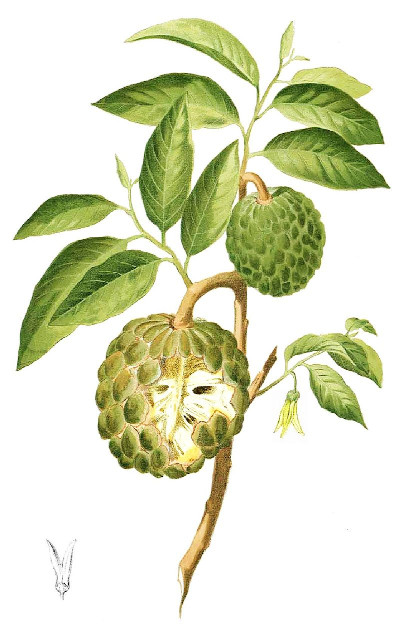

[](https://crates.io/crates/annonars)
[](https://crates.io/crates/annonars)
[](https://crates.io/crates/annonars)
[](https://github.com/bihealth/annona-rs/actions/workflows/rust.yml)
[](https://codecov.io/gh/bihealth/annona-rs)

<a href="https://commons.wikimedia.org/wiki/File:Annona_squamosa_Blanco1.192.png"></a>

# annona-rs

Genome annotation with Rust and RocksDB.

Also:

> Annona (from Taíno annon) is a genus of flowering plants in the pawpaw/sugar apple family, Annonaceae. It is the second largest genus in the family after Guatteria, containing approximately 166 species of mostly Neotropical and Afrotropical trees and shrubs.
>
> [Annona -- Wikipedia](https://en.wikipedia.org/wiki/Annona)

## Running the CLI

You can enable the annonars CLI by building the project with the `cli` feature:

```
# cargo run --all-features cli -- --help
```

## Managing GitHub Project with Terraform

```
# export GITHUB_OWNER=bihealth
# export GITHUB_TOKEN=ghp_<thetoken>
# terraform import github_repository.annona-rs annona-rs

# cd utils/terraform
# terraform validate
# terraform fmt
# terraform plan
# terraform apply
```
